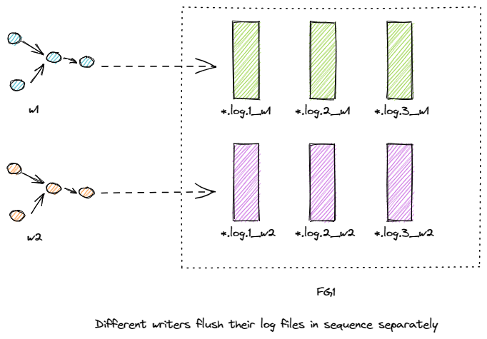
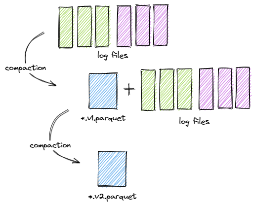
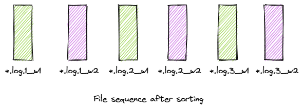

# RFC-61: Lockless Multi Writer

## Proposers
- @danny0405
- @ForwardXu
- @SteNicholas

## Approvers
-

## Status

JIRA: [Lockless multi writer support](https://issues.apache.org/jira/browse/HUDI-5672)

## Abstract
As you know, Hudi already supports basic OCC with abundant lock providers.
But for multiple streaming ingestion writers, the OCC does not work well because the conflicts happen in very high frequency.
Expand a little bit, with hashing index, all the writers have deterministic hashing algorithm to distribute the incoming records by primary keys,
all the keys are almost evenly distributed in all the data buckets, for a single data flushing in one writer, almost all the data buckets are appended,
the conflict would very possibility happen for multi-writers because almost all the data buckets are being written by multiple writers simultaneously;
For the BloomFilter index, things are different, but remember that we have a small file load rebalance algorithm to writer into the **small** buckets with higher priority,
that means, multiple writers are likely to write into the same **small** buckets in parallel, that's how a conflict emerges.

In general, for multiple streaming writer ingestion, explicit lock is not very capable of being able to put into production, in this RFC, we propose a lockless solution for streaming ingestion.

## Background

Streaming jobs are naturally suitable for data ingestion, it has no complexity of pipeline orchestration and has a smother write workload.
Most of the raw data set we are handling today are generated in real time.

Based on that, many new needs for multiple writers' streaming ingestion have emerged. With multi-writer ingestion, several streaming events with the same schema can be drained into one Hudi table,
the Hudi table kind of becomes a UNION table view for all the input data set. This is a very common use case because in practice, the data sets are usually scattered across all kinds of data sources.

Another very useful use case we wanna unlock is the real-time dataset join. One of the biggest pain point in streaming computation is the dataset join,
the engine like Flink has basic supports for all kind of SQL JOINs, but it stores the input records within its inner state-backend which is a huge cost for pure data join without additional computations.
In [HUDI-3304](https://issues.apache.org/jira/browse/HUDI-3304), we introduced a `PartialUpdateAvroPayload`, in combination with the lockless multi-writer,
we can implement N-ways data sources join in real-time! Hudi would take care of the payload join during compaction service procedure.

## Design

### The Precondition

#### MOR Table Type Is Required

The table type must be `MERGE_ON_READ`, so that we can postpone the conflict resolution to the compaction phase. The compaction service takes care of conflicts resolving on the same keys by respecting the event time sequence of these events.

#### Deterministic Bucketing Strategy

Deterministic bucketing strategy is required, because the same records keys from different writers are desired to be distributed into the same bucket, not only for UPSERTs, but also for all the new INSERTs.

#### Lazy Cleaning Strategy

Config the cleaning strategy as lazy so that the pending instants are not rolled back by the other active writers.

### Basic Work Flow

#### Writing Log Files Separately In Sequence

Basically, each writer flushes the log files in sequence, the log file rolls over for different versioning number,
a pivotal thing needs to note here is that we need to make the write_token unique for the same version log files with the same base instant time,
so that the file name does not conflict for the writers.

The log files generated by a single writer can still preserve the sequence by versioning number, which is important if the natual order is needed for single writer events.



#### The Compaction Procedure

The compaction service is the duty role that actually resolves the conflicts. Within a file group, it sorts the files then merges all the record payloads for a record key.
The event time sequence is respected by combining the payloads with even time field provided by the payload (known as the `preCombine` field in Hudi).



### The Unique Ids for Different Writers

In order to avoid file name conflicts for different writers, here we use the instant time as part of the task write_token,
so that different task from the different writers always diff in file name.
Finally, the log file name is of the following naming pattern:

```shell
${uuid}_${instant}.log.${version}_${task_token}-${instant}
```

### The Sorting Rules for Log Files from Different Writers

The sorting rules is important because it somehow decides the natual order processing,
especially when the event time field are the same, and we don't know which payload to choose when combining.
Here we can keep using the log file name compactor of current codebase, that is:

```sql
order by base_commit_time, version_number, write_token
```

For a single writer, its log files natual order is preserved by the auto increasing version number,
for multiple writers, we try the best to preserve the natual order still with the version number,
but the write_token has deterministic priority in sorting,
the file with a larger instant timestamp within the write token is considered as fresher.

